# Agentic report pipeline

This document explains how HELIX extends the current synthetic prototype from deterministic validation into section-level drafting with the Codex SDK. The design keeps evidence processing, agent output, gate decisions, human review, and export separate.

## Scope

The pipeline covers these operations:

1. Freeze the authorized manifest and start one idempotent Pinned Run.
2. Parse the protocol, template, and source data.
3. Resolve the study type from pinned protocol fields and a versioned mapping table.
4. Run Data Validation Packages by evidence domain.
5. Check the template contract before drafting.
6. Run one reusable Section Agent for each eligible Section Package.
7. Compile provenance and check the candidate against the template.
8. Promote eligible candidates to Section Drafts.
9. Assemble immutable Review Scaffold Revisions for the study.
10. Accept human-directed section revisions and approval records.
11. Export the exact approved artifact hashes after an explicit user action.

Embedding, upload-authorization policy, report-pattern selection, ambiguous study-type handling, and reviewer-role configuration remain outside this design.

## One graph controls the run

Each Data Validation Package and Section Package declares its dependencies. The backend resolves the applicable packages into one immutable `RunPlan` when the manifest freezes.

```mermaid
flowchart LR
    M[Frozen manifest] --> P[Parse inputs]
    P --> T[Resolve study type]
    T --> V[Data Validation Packages]
    V --> C[Validated Claims]
    C --> TC[Template Contract Gates]
    TC --> A[Codex SDK Section Agents]
    A --> DC[Section Draft Candidates]
    DC --> PR[Provenance Compiler]
    PR --> OE[Study Output Evaluation]
    OE --> CF[Template Conformance Gates]
    CF --> SP[Section Promotion]
    SP --> RS[Review Scaffold Revision]
    RS --> HR[Human review or revision]
    HR --> EX[Explicit export]
```

The `RunPlan` lives in the `StudyEvidencePackage`. Append-only events record node transitions and executor receipts. The Codex SDK executes eligible agent nodes, but it does not decide gate status.

## Package boundaries

Data Validation Packages group rules by evidence domain. A body-weight package validates body-weight records once and produces reusable Validated Claims. Report sections consume those claims instead of recalculating them.

Section Packages declare the inputs and constraints for one report section. A package identifies:

- Direct dependencies.
- Required Validated Claims and grains.
- Template Contract Gates.
- The qualified Section Agent skill and Promptfoo suite.
- The Section Draft Candidate schema.
- Provenance requirements.
- Template Conformance Gates.
- The three-attempt limit.

The contracts live in [`skills/helix-evidence-pipeline/contracts`](../../skills/helix-evidence-pipeline/contracts). Example packages live beside them under `packages`.

## Agent context stays section-scoped

The backend stores the complete `RunPlan`. A Section Agent receives a `SectionExecutionEnvelope` with only its package, direct dependency states and hashes, required Validated Claims, relevant study facts, and current structured failures.

If the envelope is insufficient, the agent can use Code Mode tools to request facts or artifacts from declared dependencies. The backend records the query and returned hashes. The agent cannot browse unrelated raw study data.

The agent returns one schema-validated `section_draft_candidate`. It cannot mark a section passed, approved, or ready for release.

## Gate order

Template checks occur on both sides of drafting:

1. Template Contract Gates confirm that the pinned template defines the fields, locations, table shapes, labels, units, and style constraints that the agent needs.
2. Template Conformance Gates inspect the returned candidate for completeness, table coverage, terminology, units, rounding, and approved language.

Shared code promotes a candidate only when all four conditions hold:

- No `hard_blocker` exists.
- Every `review_required` result has a current artifact-bound disposition.
- Provenance compilation passes.
- Template conformance passes.

Warnings remain visible and do not block promotion.

## Provenance constrains drafting

Deterministic extraction creates provenance from frozen source records to Validated Claims. The Section Agent can cite only those claim identifiers.

After drafting, the Provenance Compiler binds every factual span and table cell to existing claims. A missing link is a non-waivable blocker. A reviewer can remove the content, select a supported claim, or introduce authorized data through a superseding run. A reviewer cannot approve invented provenance.

## Revisions preserve history

The pipeline permits at most three Candidate Attempts in one drafting cycle. A retry can change wording, structure, and claim placement. It cannot change evidence, rules, provenance, package versions, or dependencies.

After three failures, the Review Scaffold records `[NEEDS REVIEW]`. A human can start a new three-attempt cycle for one section. The new cycle repeats provenance compilation, study-output evaluation, and template conformance. Unrelated sections do not rerun.

Every Review Scaffold Revision is immutable. A scaffold-visible state change creates a new revision with a sequence number, content hash, timestamp, triggering event, predecessor, and referenced section artifacts.

## Corrections create a new run

A Pinned Run never changes its manifest, schema, ontology, Rule Bundle, skill, template, or Promptfoo-suite versions. Unrecognized data creates a quarantined Mapping Proposal and `[NEEDS REVIEW]`.

Authorized corrections create a new manifest and a Superseding Run. The previous run stays retrievable. The new run may reuse cached parsing and normalized records only when their content hashes match. Embeddings remain outside the current implementation scope. If they return later, only validated normalized data may enter the embedding pipeline.

A section artifact can carry forward only when its complete Dependency Fingerprint matches. The new run still issues fresh validation results and gate decisions.

## Tests match the component

Promptfoo tests agent behavior. It checks whether extraction or drafting skills follow instructions, select the right executor, use only allowed claims, and produce the required shape.

Normal code tests check exact rules and calculations. They cover checksums, counts, means, denominators, provenance links, required fields, state transitions, and gate formulas.

A passing Promptfoo result cannot turn a deterministic gate green. A study-specific Promptfoo failure creates `review_required` and appears in the Review Scaffold.

## Export does not regenerate content

Explicit export packages the exact hashes in the approved release-candidate manifest. Export does not invoke an agent, recalculate a value, or render from mutable latest state. Replaying the same export request returns the same content-derived result.

See [First vertical slice](../implementation/first-vertical-slice.md) for the browser-to-Codex SDK proof.

## OpenAI implementation basis

The official [Codex SDK documentation](https://developers.openai.com/codex/codex-sdk/) documents the Python `openai-codex` package, local app-server control, thread execution, and read-only sandbox mode. The official [skills documentation](https://learn.chatgpt.com/codex/build-skills) documents repository skill discovery under `.agents/skills` and explicit `$skill-name` invocation.
