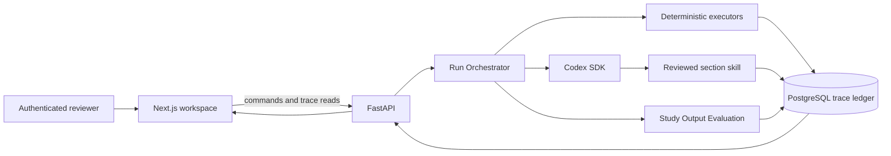
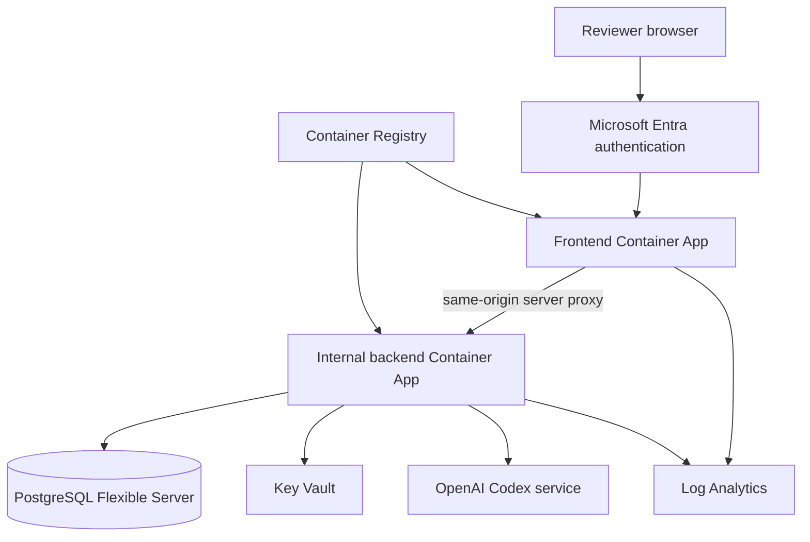

# Agentic end-to-end demo architecture

## Why this document exists

The current HELIX baseline proves deterministic validation, human review, export, and one real Codex SDK section run. The Codex candidate remains isolated from promotion and export. The baseline also lacks persisted per-step evaluation artifacts, durable live progress, and Azure deployment resources.

This design closes those gaps for one synthetic study and one body-weight section. It does not replace the broader pipeline architecture. It defines the smallest complete proof that the broader architecture can work.

## Findings from the as-built review

`docs/HELIX_Technical Architecturev1.html` and `docs/TECHNICAL_ARCHITECTURE.md` describe the same system and boundaries. Their component maps and runtime flows match the current FastAPI, Next.js, PostgreSQL, and Codex adapter shape.

The review found these blockers:

1. The backend image omits the governed package and skill directories that workspace eligibility and Codex execution read at runtime.
2. The section endpoint waits for one complete Codex turn. It does not persist streamed progress or expose a durable pause boundary.
3. Package metadata names qualification and study-output suites, but the runtime does not enforce qualification or persist study-output evaluation artifacts.
4. The Codex candidate cannot enter promotion, approval, or export. The current proof therefore stops before the user-visible product outcome.
5. Workflow events exist both inside the aggregate and in relational rows. No invariant prevents divergence.
6. The repository has no Azure infrastructure, managed secret path, schema migration path, or deployed browser proof.
7. The current UI work remains split across the existing pipeline issues and stage-gated redesign issues. New tickets must integrate those outcomes rather than duplicate them.

The baseline test command is not green in the reviewed working tree. Ruff reports five errors in pre-existing edits to `backend/app/section_executor.py`. This design task does not change that file.

## Caller experience

An authenticated reviewer opens one Azure URL and sees the seeded synthetic study at the Upload Human Gate. The reviewer authorizes the manifest and starts one Workflow Run.

The Workspace Journey advances from backend state. Within each Agent Step, the reviewer sees a Workflow Trace that updates from persisted events. Each row states whether a person, deterministic executor, Codex Skill Invocation, or qualitative evaluator acted. The row links to exact inputs, outputs, versions, hashes, and status.

The run stops at Traceability Review. The reviewer inspects deterministic results, the body-weight candidate, provenance, template conformance, and the advisory study-output evaluation. After required dispositions and synthetic role approvals, the reviewer exports and downloads the exact approved package. The exported body-weight content resolves to the promoted Codex candidate hash.

Reloading the browser does not lose progress. Replaying a command returns the prior receipt. A crash leaves an immutable interrupted attempt and a resumable run.

## Core data shape

PostgreSQL stores the current `StudyEvidencePackage` and a content-addressed trace ledger. The ledger has four core records.

| Record | Identity and purpose | Required invariants |
|---|---|---|
| `WorkflowRun` | One pinned execution for one study and governed-version set | Status follows an explicit state machine. The pinned manifest and governed versions never change. |
| `StepReceipt` | One immutable attempt by a person, executor, skill, evaluator, or exporter | Attempt number is unique within a step. Terminal receipts never change. Every input and output names a Trace Artifact. |
| `TraceArtifact` | One content-addressed prompt, envelope, result, candidate, evaluation, gate decision, approval manifest, or export | The stored bytes reproduce the recorded SHA-256 digest. Artifact kind and media type are fixed. |
| `ArtifactEdge` | One typed relation between Trace Artifacts | Both endpoints exist. The relation uses a governed vocabulary such as `derived_from`, `evaluates`, `approves`, or `exports`. |

A Step Receipt records these facts:

- Workflow Run, step, attempt, parent receipt, and idempotency key.
- Actor kind and authority class.
- Pending, running, awaiting human review, complete, failed, or interrupted status.
- Start and completion timestamps.
- Exact input and output Trace Artifact identifiers.
- Executor, Rule Bundle, skill, suite, model, and tool identities when applicable.
- Codex thread and turn identifiers for a Skill Invocation.
- Structured failure codes.
- Token and latency measures as operational metadata.

The backend derives the Workflow Trace from Step Receipts. The trace has no gate authority. Rule Bundles, provenance compilation, template gates, promotion code, and approval checks remain authoritative.

## Workflow ownership

The Run Orchestrator selects ready steps from the pinned plan. It does not calculate a rule or set a gate result. Deterministic executors write authoritative results. Codex runs only reviewed skills against scoped envelopes. Study Output Evaluation writes advisory Evaluation Artifacts.

The Codex adapter consumes turn notifications and persists public progress events. It stores the final schema-bound output and receipt. It does not request or store hidden reasoning.

## Check authority

Each workflow step declares its checks before execution.

| Check type | Runtime | Effect |
|---|---|---|
| Deterministic | Versioned Python executor and Rule Bundle | May block or permit a state transition. |
| Skill qualification | Paired Promptfoo suite against an exact skill hash | Determines whether that skill version is eligible for a Pinned Run. |
| Study Output Evaluation | Versioned qualitative suite against an exact candidate hash | May create `review_required` or a warning. A pass grants no gate authority. |
| Human review | Authenticated command bound to exact artifact hashes | Resolves only permitted review items and may authorize the next Human Gate. |

The UI never merges these categories into one pass indicator. It shows the authority class beside every result.

## Safe pause and retry

Pause takes effect at a workflow-step boundary. If a Codex turn is active, the backend requests interruption and records the Step Receipt as interrupted. Resume creates a new attempt with the same pinned inputs. It does not mutate the interrupted attempt.

Every command uses an idempotency key and request hash. Exact replay returns the stored receipt. Reusing a key for different input returns `409`. Startup reconciliation finds nonterminal runs and either resumes an eligible step or records a structured failure.

## Azure topology

Bicep creates separate frontend and backend Container Apps. Only the frontend has public ingress. The backend uses internal ingress and private PostgreSQL connectivity. The frontend server proxies API requests so the browser never receives an internal backend address.

Key Vault stores the Codex API key and database credentials that cannot use managed identity. The backend managed identity receives only the required secret permissions. Images contain the governed package and skill assets and record their digests at deployment.

PostgreSQL Flexible Server is the deployed database. SQLite remains limited to isolated tests. Schema migrations run before a new backend revision receives traffic.

## Design alternatives

### Candidate A. Extend the synchronous prototype

This candidate keeps the JSONB aggregate, adds a client trace panel, and deploys public frontend and backend containers. It has the smallest initial diff. It loses because a browser refresh or process restart can erase apparent progress, the public backend exposes model-spending commands, and mutable trace state cannot prove artifact lineage.

### Candidate B. Add a durable PostgreSQL trace ledger

This candidate keeps FastAPI, Next.js, the Codex SDK, and one PostgreSQL boundary. It adds Workflow Runs, Step Receipts, Trace Artifacts, and Artifact Edges. It supports durable progress, idempotent retries, exact evaluation binding, and an internal Azure backend. This is the selected base.

Candidate B adopts immutable image revisions and managed secrets from Candidate C. It rejects a separate queue until measured concurrency or recovery needs require one.

### Candidate C. Use Azure-native orchestration

This candidate moves execution to Durable Functions or Container Apps Jobs, sends work through Service Bus, and stores large artifacts in Blob Storage. It offers strong independent scaling and failure recovery. It loses for the first demo because callers and maintainers would need to trace several new services before one study and one section justify them.

## Tradeoffs accepted

- We accept one PostgreSQL write path in exchange for avoiding a second distributed control plane.
- We accept a single-section agent contribution in exchange for proving the whole governed path now.
- We accept database storage for bounded synthetic export bytes in exchange for one artifact authority.
- We accept safe-boundary pause semantics in exchange for honest behavior that the Codex SDK can support.
- We accept Microsoft Entra access for the demo audience without claiming compliant electronic signatures.

## Open risks

- The existing audit representations need an explicit convergence plan when the trace ledger lands.
- A long Codex turn can outlive an HTTP request. The command must return a Workflow Run receipt before execution continues.
- Container image skill discovery must use packaged immutable files rather than a mutable checkout.
- The current body-weight package remains intentionally unpromotable. Promotion requires a separately qualified package version and the existing deterministic promotion tickets.
- Real study data cannot enter the Azure demo until data classification, model egress, retention, and authorization policies exist.

## First implementation step

Package the governed runtime assets into the backend image and prove the current PostgreSQL and real Codex path through Docker Compose before changing orchestration or deploying Azure resources.
