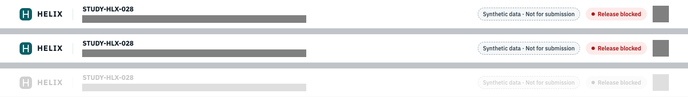
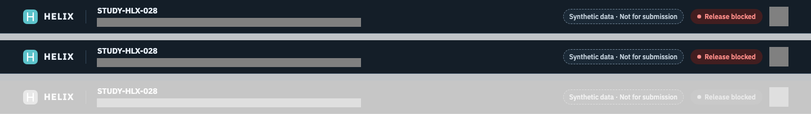
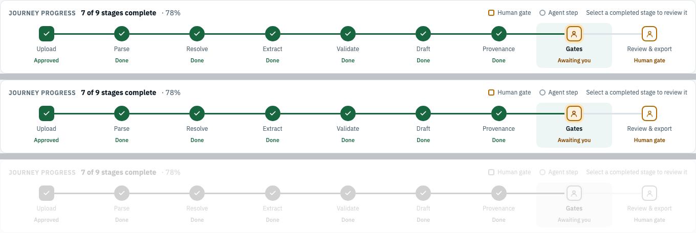
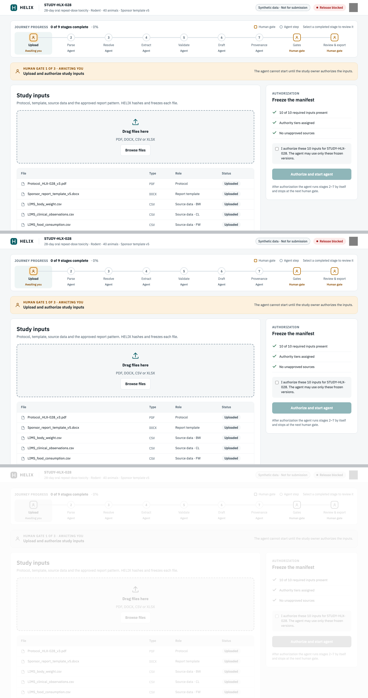
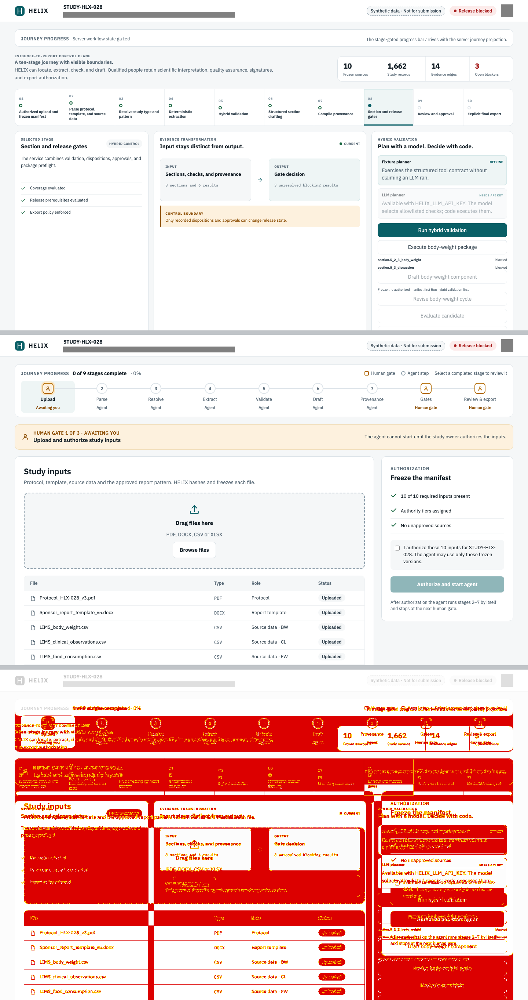

# UI step 0: visual parity kit — verification evidence

- Branch: `cursor/ui-step0-visual-parity-kit` on `Perk4/Helix`
- Base: `feat/steven-workspace` @ `e56bf7fd` (the merge of the ADO sync: Alembic migrations, `intake_jobs.py`, intake-job routes). The branch was first built on `f5776828` and was rebased locally onto `e56bf7fd` before its first push. All results below were re-run on the new base.
- Tip: the PR head commit, which adds this file. Its SHA is in the PR description.
- Date: 2026-09-24 (America/Chicago). Local macOS run, Node 22.23.2, Playwright 1.63 Chromium.
- Ports: parity 8020/3020, verify-live 8120/3120, base verify-live 8121/3121. The concurrent ADO-sync worker's 8010/3010 were not touched. No other Playwright process was running (`pgrep -fl playwright` was empty before each run).
- Sources:
  - `research/helix-e2e-workbench-v1.html`, the reference build. It wins on conflict.
  - `research/HANDOFF.md` section 6 (tokens).
  - `docs/specifications/helix-v1-ui-redesign.md`.
  - ADR 0022.
  - UI SLICE 0 (`evidence/ui-slice-0-v1-shell.md`) and the #25 journey contract (`evidence/ui-slice-7-journey-run-events.md`).
  - Issues Steven-Espaillat/Helix #19 to #23 and #26.

## What changed

**(a) One shared stylesheet and one shared component set**
- `frontend/src/styles/helix-v1.css` is the single shared stylesheet.
  - It holds the reference tokens: `light-dark()` colors; a type scale of 22/18/16/15/14/13/12/11 with weights and tracking; spacing steps plus gutter, gap, card padding, header height, and control heights; radii of 12/10/8/6/999; and halos and rings as "shadows" (the reference uses no drop shadows).
  - It also holds the CSS for the shell and every shared component: tones, card, kicker, chip, pill, button, list row, spinner, stage rail, gate and run banners, data table, and layout grids.
  - UI SLICE 0's token block and shell CSS **moved** here from `globals.css` rather than being duplicated. `globals.css` now keeps only the legacy pre-v1 panel CSS and its alias variables.
- `frontend/src/components/ui/` is the shared component set:
  - `Card`, `Kicker`, `Button`, `Chip`, `Pill`, `Spinner`, `StatusDot`, `ListRow`
  - `Banner`/`GateBanner`
  - `StageRail`: the presentational Progress Bar. Lane A maps `workspace.journey` onto it.
  - `DataTable`/`FileCell`
  - `cx`/`toneClass`/`toneColor`
- New icons: `ChevronIcon`, `FileIcon`, `UploadIcon`.
- The shell uses the set:
  - `components/shell/ShellHeader.tsx`, extracted from `HelixWorkbench`.
  - `ReleasePill` now renders `Pill`.
  - The boundary states use `Card`, `Kicker`, `Button`, and `Spinner`, and the notices use `Button`.
- The lane view stylesheets are seeded from the reference and already imported by `layout.tsx`, so lanes never edit the layout: `src/styles/views/{upload,agent,traceability,review}.css`.
- The shell is now closer to the reference. The parity kit found each of these:
  - The header study ID renders in Plex Sans 700, as in the reference. UI SLICE 0 used Plex Mono 500. The HTML wins over HANDOFF, and `shell.spec.ts` was updated to match.
  - The study descriptor is an inline span under a block `<strong>`, as in the reference. The old block span moved the header text by about 2 px.
  - `-webkit-font-smoothing: antialiased` was removed from `body`. The reference does not set it, and it changed text rasterization.
  - The logo stroke and the solid-fill foregrounds use the new `--hx-on-solid` token, which is white in both themes as in the reference. Before, the dark-theme logo stroke was dark, and `t-block-solid` text used `--hx-surface`.
- **Study-selection seam** (added by the scope update):
  - `components/shell/StudyContext.tsx` provides `StudyProvider` and `useStudySelection()`. `studyId.ts` provides `DEFAULT_STUDY_ID` and `normalizeStudyId()`.
  - `SelectedStudyWorkbench.tsx` renders the workbench for the selected study.
  - `app/page.tsx` reads `?study=`. The shell no longer hard-wires `STUDY-HLX-028`; that ID is only the default.
  - Lane A (#26) calls `selectStudy(id)` after an intake job completes.

**(b) The parity kit** is `frontend/tests/parity/`, run by `scripts/verify-parity.sh` or `npm run test:parity`. How to use it and the threshold rationale are in `frontend/tests/parity/README.md`.
- Settings: 1440x900 at scale factor 1; pixelmatch threshold 0.1 with anti-aliased pixels excluded; the run **fails above 1.0 %** of compared pixels.
- Per-screen `maxDiffRatio`, `pixelThreshold`, masks, and `replaceText` are supported.
- Our base URL comes from `HELIX_PARITY_BASE_URL`. Self-started servers use `HELIX_PARITY_API_PORT`/`HELIX_PARITY_WEB_PORT`.
- Pending lane screens are skipped until a lane turns them on, or are captured report-only with `HELIX_PARITY_INCLUDE_PENDING=1`.
- The reference's Google Fonts request is answered with the app's own `@fontsource` files, so both sides use identical fonts and the run works offline.
- The component fixtures are at `/parity?fixture=upload&stage=N` and return 404 unless `HELIX_PARITY_FIXTURES=1`.
- `playwright.config.ts` ignores `parity/**`, so `verify-live.sh` does not run the kit.
- `scripts/verify-live.sh` gained optional `HELIX_LIVE_API_PORT`/`HELIX_LIVE_WEB_PORT`/`HELIX_LIVE_DIST_DIR`. The defaults are unchanged (8010/3010/.next-e2e).

**(c) Ownership map:** `docs/ui-lanes-ownership.md`. It includes the scope update: Lane A = #19, #20, #26; Lane D = #23 plus the demo-unqualified flag at both the freeze/run and export gates. It also covers the new base: `backend/migrations/**` and `alembic.ini` are SHARED, and `intake_jobs.py` belongs to Lane A.

No backend file changed: `git diff e56bf7fd -- backend` is empty.

## Results: base `e56bf7fd` vs branch

| Check | Command | Base `e56bf7fd` | Branch | Delta |
|---|---|---|---|---|
| Ruff | `cd backend && uv run ruff check app tests scripts` | 5 errors (`intake.py` B905, `main.py` I001 + 2x B008, `tests/test_intake.py` F401) | the same 5 (the backend is byte-identical to the base) | 0 |
| Typecheck | `cd frontend && npm run typecheck` | pass | pass | none |
| Build | `cd frontend && npm run build` | pass | pass; `/` is now dynamic (`ƒ`) because it reads `?study=`, and `/parity` is dynamic and gated | see the risks |
| Live e2e | `HELIX_LIVE_API_PORT=812x HELIX_LIVE_WEB_PORT=312x ./scripts/verify-live.sh` | **16 passed / 2 failed / 1 skipped** | **16 passed / 2 failed / 1 skipped** | same failing set |
| Parity | `./scripts/verify-parity.sh` | n/a | **9/9 enforced screens pass at 0.000 %**; 1 report-only; 6 pending skipped | new |

The two verify-live failures are the same on the base and the branch:
- `workbench.spec.ts › runs the synthetic study from validation through explicit export`
- `workbench.spec.ts › renders predecessor run identity and carry-forward counts from the workspace`

Both come from the known section-package qualification 422 (`POST /validation-runs` returns 422, and the UI shows "The HELIX API returned an unexpected error."). The Codex live spec is skipped without `HELIX_CODEX_LIVE=1`. All 4 `shell.spec.ts` tests pass on the branch, including the light and dark header tests with the updated Plex Sans study-ID and journey-only navigation assertions. The first branch run, before the fix, failed only `plexMonoLoaded`, because nothing rendered Plex Mono 500 any more. The assertion now checks that the server workflow-state identifier computes to Plex Mono 400.

`make test` is not a useful gate here. It stops at ruff because of the 5 upstream errors, the same as in the UI SLICE 0 and UI SLICE 7 evidence. The steps above were run on their own.

## Parity results (1440x900 @1x, max 1.00 %, pixelmatch 0.1)

| Screen | Status | Diff ratio | Result |
|---|---|---|---|
| shell-header-light | enforced | 0.000 % | PASS |
| shell-header-dark | enforced | 0.000 % | PASS |
| component-stage-rail-s0-light | enforced | 0.000 % | PASS |
| component-stage-rail-s7-light | enforced | 0.000 % | PASS |
| component-stage-rail-s0-dark | enforced | 0.000 % | PASS |
| component-gate-banner-light | enforced | 0.000 % | PASS |
| component-file-table-light | enforced | 0.000 % | PASS |
| component-auth-card-light | enforced | 0.000 % | PASS |
| component-upload-composition-light | enforced | 0.000 % | PASS |
| shell-viewport-light | report-only | 6.182 % | reported |
| journey-progress-light (A #19), upload-gate-light (A #20), agent-step-light (B #21), traceability-gate-light (C #22), review-export-light/-dark (D #23) | pending | — | skipped |

What "0.000 %" covers:
- **Shell header:** the real `/` shell against a fresh synthetic seed, compared with the reference `.hx-top`. Two regions are masked on both sides. (1) The study descriptor, because it is server data and the reference copy is static. (2) The avatar, the documented #27 deviation: a synthetic identity icon instead of initials.
- **Component screens:** the shared components render the reference copy in the `/parity` fixture, composed as the reference `?stage=N` page, so every element sits at the same sub-pixel offset.

**Why the whole viewport is only report-only:** below the header, the shell still renders the pre-v1 panels (study journey, evidence chain, report assembly). The lanes replace them, so 6.18 % is today's honest distance. The measurement is kept in the report and not enforced.

**Negative control** (not committed): `--hx-radius` was changed from 12 to 8 px and `--hx-fs-step` from 11 to 12 px, then the kit was run again. 7 of 9 enforced screens **FAILED**, at 1.55 % to 4.55 %. The rail and table screens also reported size mismatches of +1 to +2 px. The two header screens do not use those tokens and stayed at 0 %. The CSS was then restored.

**Pending lane screens today** (report-only run with `HELIX_PARITY_INCLUDE_PENDING=1`, not committed). These show where each lane starts:

| Screen | Diff ratio | Sizes |
|---|---|---|
| journey-progress | 66.5 % | ours 1360x48 vs reference 1360x144 |
| upload-gate | 81.7 % | |
| agent-step | 88.7 % | |
| traceability | 84.1 % | |
| review-export light / dark | 86.8 % / 89.3 % | |

For the last four, ours is the 4,265 px legacy stage view.

**Threshold history (the kit found real bugs before the fixes above):**

| Stage | Screen | Diff |
|---|---|---|
| Header, first run | light / dark | 0.515 % / 1.079 % (dark FAILED) |
| After the inline descriptor fix | dark | 0.69 % |
| After removing font smoothing | both | 0 % |
| Before the fix: fixtures captured in isolation (a different fractional y offset than the reference) | gate banner / auth card / table | 4.5 % / 2.8 % / 2.1 % |

The composed fixture removed the fractional-offset diffs. The threshold was never raised.

### Side by side (ours / reference / diff, top to bottom)

Every screen's `side-by-side.png` and `result.json`, plus `summary.md` and `summary.json`, are committed under `evidence/parity/`. The files `ours.png`, `reference.png`, and `diff.png` are generated locally and gitignored, because the side-by-side already contains all three. `evidence/helix-v1-shell-{light,dark}.png` were regenerated by `shell.spec.ts` and show the updated header.

## Deviations and decisions

- **Study ID font:** Plex Sans, as the reference renders it. HANDOFF says "Mono for IDs", but the HTML wins. Mono stays for other identifiers such as the workflow state.
- **Masked, documented deviations:** the header avatar (#27) and the server-driven study descriptor.
- **The StageRail is not wired into the shell.** #19 (Lane A) owns mapping `workspace.journey` onto it, and it must not use a merge table. The shell keeps the reserved `progress-region`.
- **Legacy panel CSS is still in `globals.css`.** Lanes delete their panels' rules when they replace them (a deletion-only exception in the ownership map).
